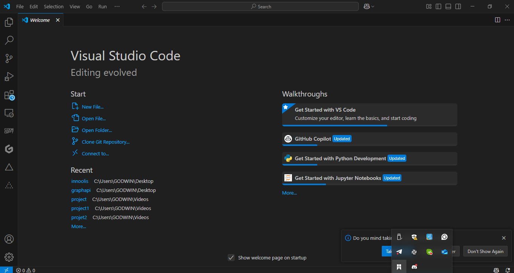
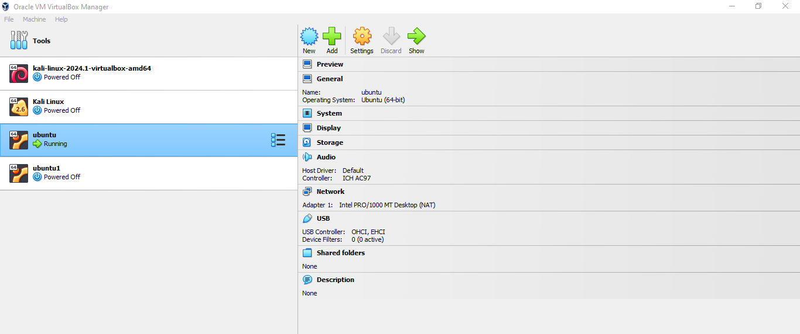
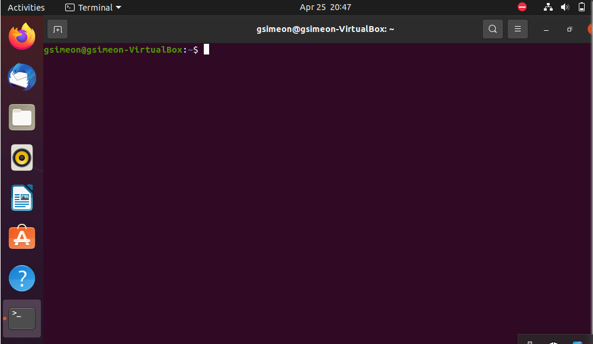
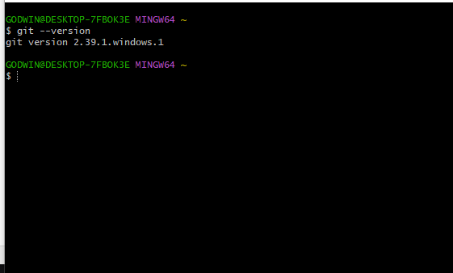
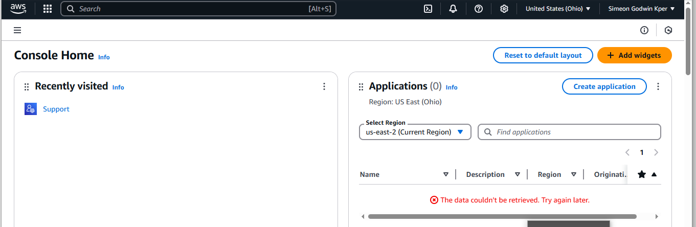

# DevOPs Class

### I have installed Visual studio, Below is the snapshot

### I have installed Virtual box, Below is the snapshot

### I have installed Ubuntu, Below is the snapshot

### I have installed Git Bash, Below is the snapshot

### I have installed Github Desktop, Below is the snapshot

### I have logged in to AWS, Below is the snapshot

